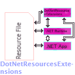

# The `DotNetResourcesExtensions` Project 

-> What is it?

The name `DotNetResourcesExtensions` refers to exactly what is meant to be:

`"Defines extensions for .NET for Resource API's"` .

That is it.

This project aims to find new alternatives and ways of reading , getting , writing and loading .NET 
resources on a managed application.

The result of this are the `IResourceLoader` and `IResourceTransferer` interfaces , and their accompanying classes.

But it does not stop here. It defines also diverse classes for reading and writing resources:

- Custom binary resources. It is the first custom resources binary format for this library.

- Custom JSON resources. Writes and reads out custom JSON resources using the `System.Text.Json` API's.

- Custom XML resources. Writes and reads out custom XML (NOT `Resx`) using the `System.Xml` namespace.

- Custom MS-INI resources. Although that sounds weird , those classes depend on a pseudo-syntax of the usual INI files to write and read resources.

- Custom ResX resources. These are modified copies of the ResX classes defined in the [Windows Forms Project](https://github.com/dotnet/winforms). 
The Windows Forms ResX reader cannot read the results produced from them , because they are modified to accomondate some changes in order to make them cross-compatible.
	
    - Due to the modifications happened , one of them was to remove the usage of BinaryFormatter , and create an
	alternative to it. The result was a custom formatter that is allowed to serialize only specific objects.
		- You can also use it and extend it too!

Also this project includes a build task to use for MSBuild projects for resource generation
through the `DotNetResourcesExtensions` project. See the `BuildTasks` project for more info.

Currently , the implementation is fairly enough stable.
For now , documentation is underway and soon it will be uploaded.

Please report any bugs you have found out during the project usage.

Most programs are imperfect , and even this one is no exception. 
I will be very glad to hear about bugs you have found!

	(This project is open-source and is liscensed under the MIT Liscense)

